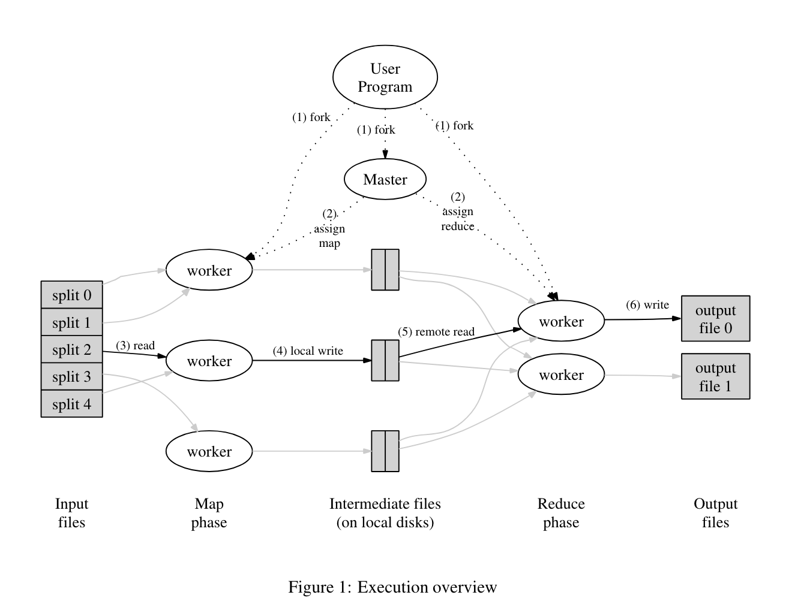

## Introduction
To process multiple tasks in parallel, dataset is distributed across multiple machines for processing, and results are merged. Also, tasks fail for many reasons e.g. machine crash, network loss. To achieve fault tolerance, system should recover from these failures.

## MapReduce ##
- Map function
    - input: key/value
        - e.g. filename/content
    - output: generate intermediate key/value pairs which are stored in the corresponding partition
- Reduce function
    - input: intermediate key/value pairs for a given key
    - output: merge the value for a intermediate key and store the results in a reduce parition file.
- Tasks are assigned by a master
    - It simplifies the design. Worker doesn't have to remember the status of other works by over-talking on the network. Only master knows status of all the workers.
- Locality: worker reads input file from nearby machine
    - Network bandwidth is more likely the bottleneck
        - Modern CPU speed ~GHz
    - Map worker reads input file on GFS(ideally, worker machine should have replica of the file) and generates output file in local machine
    - Reduce worker reads input file on nearby map worker machine.
- When tasks fail, simply re-run them.
    - Note that input and output are immutable


- M splits
    - input data are split into M slots
- R splits
    - intermediate key/value pairs are partitioned
        - hash(intermediate_key) % R
    - Each reduce worker processes data from a partition. Output is stored in one partition, too.

## MapReduce Lab Implementation ##

In this lab, tasks are not run on multiple machines but rather on multiple threads on a machine.
- Every input/output files can be found on the local disk. You don't have to worry about picking the right(nearby) worker machine for the tasks.

```golang
// @ master
const IDLE = 0
const IN_PROGRESS = 1
const COMPLETED = 2

const MAP = 0
const REDUCE = 1

type Task struct {
	TaskNumber int
	Files      []string
	JobType    int
	Status     int
	UnixTime   int64
	index      int // position at the priority queue
}
```
- **Status** field in the **Task** type can be in three state: **IDLE**, **IN_PROGRESS**, **COMPLETED**.
- **JobType** can be either **MAP** or **REDUCE**.
- **Files** is a slice of string. A worker may have to work on multiple files in one partition.
- **UnixTime** is updated to current when status of the task changes. Master health check the in-progress task by how much time elapses since then.
- Master assigns tasks based on **TaskNumber**. Worker notifies master about completed task number. Then, master can mark the task with **COMPLETED**.

```golang
type Coordinator struct {
	Tasks            []Task
	IdleQ            PriorityQueue
	ProcessPQ        PriorityQueue
	NumOfReduceTasks int
	NumOfMapTasks    int
	Partitions       SafeMap
	Counter          SafeCounter
}
```
- **Tasks** slice is used for constant lookup when worker reports back with a task number. e.g. Tasks[taskNumber]
- Use two priority queues, **IdleQ** and **ProcessPQ**, to store idle and in-progress task.
    - A task is popped from **IdleQ** when a worker asks for it. Then, task is pushed to the **ProcessPQ**
    - A task is removed from **ProcessPQ** and push to **IdleQ** when a in-progress task has been stale for too long
    - why priority queue is prefered to slice?
        - select a task based on highest priority while achieve on average $logN$ time for pop and push operations.
        - e.g. A task that failed should be assigned soon; Remove task that has been stale for a long time or is completed
    - Priority Queue should be thread safe.
        - Multiple workers can ask master for the task concurrently through RPC
- **Partitions** collects map output file location in corresponding partitions. They should be thread safe as well.
- Thread safe **Counter** tracks number of tasks that have completed. It is used to:
    1. close worker and master when all tasks are finished.
    2. make reduce tasks for each partition when all of map tasks are done.

```golang
type SafeCounter struct {
	Count int
	Cond  *sync.Cond
}
```
- Count tracks number of completed tasks
- Cond is used to wake up sleeping threads when condition is met.
    - Reduce worker receives its task from master when all map tasks are completed. Before map tasks are done, master threads are put into sleep when reduce worker as for a task.


```golang
type SafeMap struct {
	partitions map[int][]string
	mu         sync.RWMutex
}
```
- **partitions** stores partition number along with files
- **mu** provides synchronization when multiple map workers finish tasks at the same time and ask master to update **partitions** concurrently.


```golang
type PriorityQueue struct {
	tasks []*Task
	mu    sync.RWMutex
}
```
- **tasks** is a binary heap. It allows push and pop operation in $logN$ time.
- **mu** is a read write lock that provides synchronization in concurrent push and pop, while allow many reads to be efficient.
